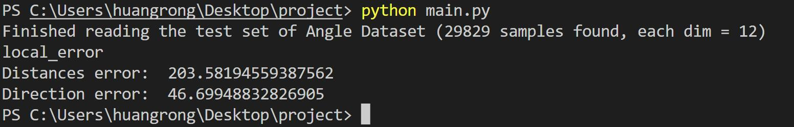

# 室内行人移动方位推算技术

**摘 要：** 由于室内GPS信号受到阻隔，同时车库场景无线接入点AP较为稀疏，导致室内定位很难通过GPS或位置指纹等技术实现。这时候，我们可以使用行人行位推算技术（Pedestrian Dead Reckoning，PDR），即在GPS阻隔条件下，利用手机内置传感器（包括不限于加速计、陀螺仪、磁强计），设计轻量级低功耗算法运行框架和技术，实现稳定可靠、高精度的方位推算计算。
**关键词：** PDR；卡尔曼滤波器；惯性导航方程；欧拉角；神经网络
**实验任务：** 利用手机传感器自行收集数据，并设计算法推断设备位置信息。

## 目录

- [室内行人移动方位推算技术](#室内行人移动方位推算技术)
  - [目录](#目录)
  - [实验环境](#实验环境)
    - [开发环境](#开发环境)
    - [第三方依赖](#第三方依赖)
    - [运行代码方式](#运行代码方式)
    - [项目结构](#项目结构)
  - [数据收集](#数据收集)
  - [PDR算法设计](#pdr算法设计)
    - [简单移动平均法（SMA）](#简单移动平均法sma)
    - [样条插值法](#样条插值法)
    - [步长推算](#步长推算)
    - [计算偏航角（IMU的yaw值）](#计算偏航角imu的yaw值)
  - [代码运行与误差矫正](#代码运行与误差矫正)
    - [偏航角误差](#偏航角误差)
    - [卡尔曼滤波](#卡尔曼滤波)
      - [卡尔曼滤波器改良运行结果](#卡尔曼滤波器改良运行结果)
    - [神经网络](#神经网络)
      - [MLP改良运行结果](#mlp改良运行结果)
  - [模型迁移](#模型迁移)
  - [小组分工](#小组分工)

## 实验环境

### 开发环境
  
- Visual Studio Code 1.56.2 (user setup)
- Python 3.8.0 64-bit

### 第三方依赖
  
- numpy
- pandas
- matplotlib
- sklearn
- scipy
- geopy
- torch

### 运行代码方式

- 在程序目录下运行以下代码，一键下载依赖

```
pip install -r requirements.txt
```

- 执行

```
python main.py
```

### 项目结构

```
\HOMEWORK\AML\HW1\PROJECT
|   dataProcessor.py  #读取和处理数据
|   main.py 
|   mlp.py  #多层感知机，用来预测角度
|   pdr.py  #pdr，包含步长推断，磁力计和加速度计，陀螺仪和磁力计计算yaw等方法
|   requirements.txt
|   test.py
|       
+---data #存放待测数据
|       
+---mlp_data  #存放用来训练神经网络的数据
+---models
|       model.pth #存放训练好的神经网络模型
```

## 数据收集

- 我们收集了20条数据（包括与其他组交换采集的数据）。
  - 其中9条数据为手机平放在手中的数据，10条数据为手机放在包里的数据，1条数据为手机放在口袋里的数据。
  - 每条数据在2min-5min不等，采集了手机内置传感器Accelerometer，Linear Accelerometer，Gyroscope，Magentometer，Barometer和Location的数据。
- 数据的处理位于文件 *dataProcessor.py* 中
- 以及，在最后利用神经网络时，我们对数据额外进行了十折交叉处理。我们把1/10数据作为验证集，9/10作为训练集。

  ```python
  # Splitting training data into train & dev sets
  if mode == 'train':
    indices = [i for i in range(len(data)) if i % 10 != 0]
  elif mode == 'dev':
    indices = [i for i in range(len(data)) if i % 10 == 0]
            
  # Convert data into PyTorch tensors
  self.data = torch.FloatTensor(data[indices])
  self.target = torch.FloatTensor(target[indices])
  ```

- 通过查阅资料，我们发现行人行位推算技术与现有的惯性导航系统有异曲同工之处，而使用脚踏式惯性测量单元(IMU)的行人航位推算(PDR)是许多室内定位技术的基础。
  - 一般情况下，IMU有三个部分组成：加速度计(Accelerometer)、陀螺仪(Gyroscope)和磁力计(Magnetometer)，它们提供了IMU的roll值和pitch值和yaw值。我们使用欧拉角、旋转矩阵，尤其是四元数来表示惯性传感器的姿态（或方向），具体方法在下一节展示。

## PDR算法设计

PDR（Pedestrian Dead Reckoning，PDR）算法能在无信标条件下，通过加速度三轴加速度值和方向角感知行人在行进过程中的加速度和方向角，并利用这些数据对行走路线进行相对定位，从而在GPS信号阻隔的情况下对行人进行定位跟踪。其中主要涉及的过程有步态检测和方向计算，即通过利用起始位置，方位角θ，步长d，并结合步数信息不断计算当前的位置。使用PDR实现室内定位，主要分为三个部分：步态检测（计步），步长推算，方位推算。

### 简单移动平均法（SMA）

步态检测目前使用的方法都比较一致：利用用户在行走时加速度轨迹在是与上呈周期性变化的特点使用移动设备中加速度传感器三轴的模值，从中检测阈值进行计步。
但人行走时的随意性和传感器的精度，导致加速度值并不准确从而不能直接拿来使用。所以在开始对数据进行处理前，我们采用简单移动平均法（SMA）来进行数据平滑。其原理如下：

> 1. 获取K组数据，相加除以K，得到平滑的数据。
> 2. 下次获取数据时，剔除第一个数据并将获取的数据加入。
> 3. 再将数据相加处理K，得到平滑数据，以此循环。

最后对三轴数据取模值，当检测到波峰且两次波峰时间差大于某时间阈值，波峰波谷差值大于动态阈值则步数+1。动态阈值的计算方式是使用一个滑动窗口，当波峰波谷差值大于某值时将差值加入窗口，不断计算窗口平均值作为动态阈值，使用动态阈值是为了保证自适应性。

### 样条插值法

我们预测的是产生第几步的时间和第几步的位置，却需要第几秒的位置。因此我们选择用插值的方法。

**插值法的定义：** 给出函数f(x)的一些样点值，选定一个便于计算的函数形式，如多项式、分式线性函数及三角多项式等，要求它通过已知样点，由此确定函数φ(x)作为f(x)的近似。用多项式作为研究插值的工具称为代数插值。

*至于哪种插值法也是个值得讨论的问题。* 插值不同于拟合。插值函数经过样本点，拟合函数一般（例如：最小二乘法逼近、切比雪夫多项式、范德蒙矩阵多项式逼近）尽量靠近所有样本点穿过。常见插值方法有拉格朗日插值法、分段插值法、KroghInterpolator样条插值法、Hermite插值法等，为了获取较为光滑的曲线，我们最终选择的是样条插值法。

样条插值是使用一种名为样条的特殊分段多项式进行插值的形式。由于样条插值可以使用低阶多项式样条实现较小的插值误差，这样就避免了使用高阶多项式所出现的龙格现象，所以样条插值得到了流行。由于其对于二阶导数的限制，通过样条插值，通常我们可以获得较为平滑的曲线。其中差值函数具体定义如下：

$$
\begin{aligned}
&已知函数y=f(x)在区间[a,b]上的(n+1)个节点a=x_0<x_1<...<x_n=b\\
&上的函数值y_i=f(x_i)(i=0,1,...,n)，其插值函数S(x)满足\\
&(1)S(x_i)=f(x_i),(i=0,1,...,n);\\
&(2)S(x)\in C^2[a,b]。
\end{aligned}
$$

> scipy.interpolate包里提供了两个函数splev和splrep共同完成(B-样条:贝兹曲线(又称贝塞尔曲线))插值，和之前一元插值一步就能完成不同，样条插值需要两步完成，第一步先用splrep计算出b样条曲线的参数tck，第二步在第一步的基础上用splev计算出各取样点的插值结果。

### 步长推算

对于步长推算一般使用线性频率模型或者经验模型，线性频率模型主要是使用身高和步频对步长建立线性关系。这种方式一般计算成本低，但是错误率较高。

目前多数使用PDR进行定位所使用的步长推算方法一般都是使用参数模型。参数模型在Pedestrian dead reckoning for MARG navigation using a smartphone这篇论文提出，使用了一个经验模型。

$$
step\_ length=C*\sqrt[4]{A_{max}-A_{min}}
$$

> Amax、Amin表示步态检测中加速度的最大和最小值，C是比例系数，它代表了不同用户的身高步频朝向对步长的影响。

### 计算偏航角（IMU的yaw值）

偏航角的计算利用了IMU的磁力计（Magnetometer），公式如下：
$$
\begin{aligned}
&mag_x=magRead_X*\cos{(pitch)}+magRead_Y*\sin{(roll)}*\sin{(pitch)}+magRead_Z*\cos{(roll)}*\sin{(pitch)}\\
&mag_y=magRead_Y*\cos{(roll)}-magRead_Z*\sin{(roll)}\\
&yaw=180*\frac{\arctan\frac{-mag_y}{mag_x}}{\pi}  
\end{aligned}
$$

> The yaw angle is the angle of rotation around the z-axis (which points straight out of this page) as measured from the x axis.（yaw角是绕z轴的旋转角）

## 代码运行与误差矫正

- 可以看到，初步思路完成项目后我们的结果差强人意，尤其是角度误差较大，因此我们尝试了一系列方法对我们的算法进行优化。

<div align="center">

</div>

### 偏航角误差

初步实现后最重要的问题是yaw角度误差很大，以此导致距离误差也失去了参考价值。我们对此进行了讨论分析，可能的原因如下：

- 大部分情况下，磁力计都需要矫正（零偏误差，标度系数误差，三轴垂直误差）：
  - 电子指南针主要是通过感知地球磁场的存在来计算磁北极的方向。然而由于地球磁场在一般情况下只有微弱的0.5高斯，而一个普通的手机喇叭当相距2厘米时仍会有大约4高斯的磁场，一个手机马达在相距2厘米时会有大约6高斯的磁场，这一特点使得针对电子设备表面地球磁场的测量很容易受到电子设备本身的干扰。
  - 由于具有磁性物质或者可以影响局部磁场强度的物质存在，磁传感器所放置位置上的地球磁场会发生偏差。当存在外界磁场干扰的情况时，测量得到的磁场强度矢量α将为该点地球磁场β与干扰磁场γ的矢量和。记作：$$\alpha_{测量值}=\beta_{地球磁场}+\gamma_{干扰}$$
- 坐标系存在误差，我们选取角度与测试集取值方式不同；
- 传感器是加速度计（含重力）线加速度计（不含），加速度计-线加速度计只有重力，也许产生了数据错误（但是我们尝试进行了数据矫正后发现：误差更大了）；
- 公式前提不适用。公式形成的方法是$$A_b=R_n^b*A_n$$Ab表示传感器实际测量的值，An是静止状态（参考系和载体坐标系重合下）的加速度。公式视An为[0 0 g]，通过磁力把传感器数据转换到水平面。这其中隐含着要求：**力只能在竖直面。** 而我们的走路过程似乎不满足这个条件。[参考资料：姿态估计-旋转矩阵-四元数](https://zhuanlan.zhihu.com/p/336357646 "无人机飞控算法")

**那么行走角度应该如何优化？** 我们提出了四个想法。

1. 利用卡尔曼滤波削减陀螺仪的compouding eroor；
2. 使用神经网络方法；
3. 用机器学习的方法拟合，利用accelerometer与磁力计计算；
4. 用陀螺仪和accelerometer计算四元数（或欧拉角）[参考资料：四元数解算姿态](http://blog.chinaunix.net/uid-27875-id-5767606.html)  [Madgwick_Filter](https://github.com/bjohnsonfl/Madgwick_Filter) 但该方法累加了旋转角，因此很快就出现了巨大的compounding eroor（见下图），同时138s的转弯没有产生变化，似乎是旋转太快被过滤掉了。

<div align="center">

</div>

我们重点关注的是卡尔曼滤波器与神经网络对误差的优化。

### 卡尔曼滤波

卡尔曼滤波器本质上是一个状态估计器，适用于模型精确和随机干扰信号统计特性已知的线性系统。他的本质是**贝叶斯模型 + 最小均方误差估计** ，其大致步骤如下：

> 1. 根据上一次的最优状态估计和最优估计误差去计算这次的先验状态估计和先验误差估计
> 2. 根据本次先验误差估计和测量噪声，得到卡尔曼增益
> 3. 根据当前测量值和先验状态估计值，通过卡尔曼增益加权，得到本次的最优估计

因此我们可以在任何含有不确定信息的动态系统中使用卡尔曼滤波，对系统下一步的走向做出有根据的预测，即使伴随着各种干扰，卡尔曼滤波总是能指出真实发生的情况。**在连续变化的系统中使用卡尔曼滤波是非常理想的，** 它具有占用内存小的优点（除了前一个状态量外，不需要保留其它历史数据），并且速度很快，很适合应用于实时问题和嵌入式系统。[原理描述参考：extended-kalman-filter](https://automaticaddison.com/extended-kalman-filter-ekf-with-python-code-example/)

具体而言，其预测公式为（predict step）：
$$
\begin{aligned}
\begin{split}
\tilde{x_k}&=F_k\tilde{x}_{k-1}+B_k\overrightarrow{u_k}\\
P_k^-&=F_kP_{k-1}F_k^T+Q_k\\
\end{split}
\end{aligned}
$$

- 即使用系统的状态空间模型，根据时间k-1的状态估计和时间k-1的控制输入来预测时间k的状态。
  - 这与我们在状态空间建模中所做的一致。
- 根据之前的协方差和一些噪声来估计状态协方差

状态更新方程（correct step）:
$$
\begin{aligned}
\begin{split}
K_k&=P^-_kH_K^T(H_kP_k^-H_k^T+R_k)^{-1}\\
\tilde{x_k}&=\tilde{x_k}+K_k(\overrightarrow{z_k}-H_k\tilde{x_k}^-)\\
P_k&=P_k^--K_kH_kP_k^-
\end{split}
\end{aligned}
$$

- 计算当前时间k的实际传感器测量值和测量模型预测的传感器测量值的差
- 计算测量残留协方差。
- 计算最佳的卡尔曼增益。
- 计算时间k的最新状态估计。
- 更新时间k的状态协方差估计值。

公式中各参数具体含义如下图所示：

<div align="center">

</div>

> 代码中使用的是Python FilterPy包：贝叶斯滤波器库，其中含有卡尔曼滤波器。

#### 卡尔曼滤波器改良运行结果

- 添加卡尔曼滤波器后，我们的误差得到了减少，但是仍不理想。因此我们转换思路，采取了第二种优化策略。

<div align="center">

</div>

### 神经网络

之前我们都在用白箱模型建模，但是结果并不是那么理想。白箱模型成立的前提是 **非常强的假设** 。为了达到更好的模型，获得一个更加准确的角度，我们决定用黑箱模型进行尝试。神经网络是现在普遍使用且模型表达力比较强的一类方法，故我们选择用神经网络。为了防止在小数据集上过拟合，我们尽量选取了比较简单的网络结构。我们尝试了：两层全连接层与三层全连接层的网络.

在训练神经网络过程中，我们遇到的问题有： *predict和loss为NAN（见附图）*

<div align="center">

</div>

我们通过分析得出的原因并尝试了以下解决方法：

> 1. **梯度爆炸**
>    - 在损失函数中加入L1，L2正则项
>    - 减小神经网络深度
>    - 选择更好的优化器，避免进入比较极端的环境（采用[常见优化器adagrad](https://juejin.cn/post/7025454765131694117)）
> 2. **数据不规整，** 即对数据没有足够的处理导致脏数据影响结果。
>    - 换数据集

#### MLP改良运行结果

在使用神经网络之后，我们利用神经网络预测的角度结合步长推断对位置与角度进行估计，发现结果有比较好的提升。同时我们觉得这个方法有一个比较大的问题是：我们是拿传感器的值来进行未来的角度的预测。目前我们使用的多层感知机基本完全依赖于当前的状态而不依赖与之前的状态，但是直观来看，角度的变化应该是一个时序问题，当前的角度和前时刻角度与陀螺仪数值高度相关。之后我们考虑用RNN来对这个问题建立一个时序性建模。

<div align="center">

</div>

## 模型迁移

在本项目中，我们总共使用了三种不同的方法来测量行走的角度。

1. 第一种方法我们是通过磁力计和加速度计来计算出行人行走的角度，因此这种方法使用于所有能提供计算重力加速度和磁感应的设备，在理想情况下，它的迁移能力是比较强的；但在实际情况下，可能由于不同设备的测量误差和噪声的不同而有一定的差异。
2. 第二种方法我们用陀螺仪和旋转角相关知识，这个方法同时通过磁力对compounding eroor进行了矫正，这是一个比较前沿的方法。同样的，他由于是一种白盒模型，对所有设备可行，但效果不太稳定，依赖于假设和环境噪音等等外在条件。
3. 第三种方法神经网络模型众所周知对数据容易存在过拟合的情况，我们的实验也确实表明它在不同数据集上性能差异较大，尤其是不在其所训练的数据集上性能较差，模型迁移能力还有待提升。我们未来考虑在大量数据上先进行训练，得到普遍情况下表现较好的模型，之后再针对特定任务进行微调，在这种范式下或许模型的迁移能力能获得较大提升。

  <div align="center">
  
  </div>
  <div align="center">
  
  </div>

## 小组分工

| Name     | ID | Work     |
| :---:       |    :----:   |         :---: |
| 肖思远      | 201300032       | 算法设计与优化   |
| 王瑾   | 201300023        | 资料汇总与报告      |
| 黄蓉   | 201300021        | 数据收集与测试     |